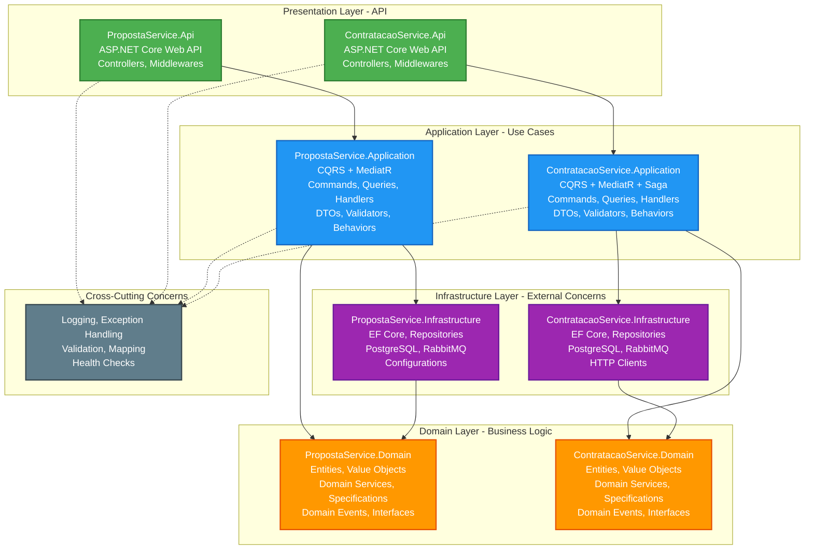
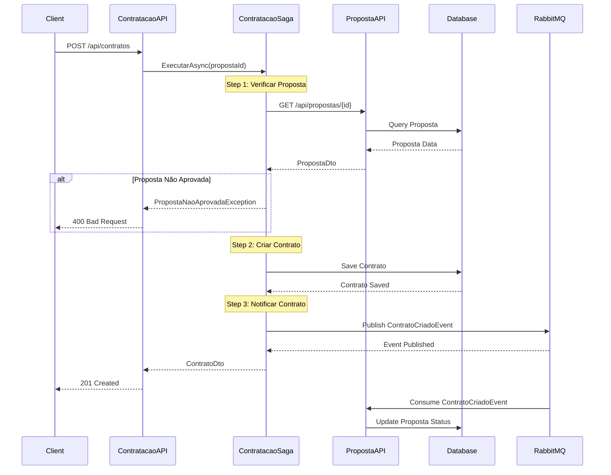
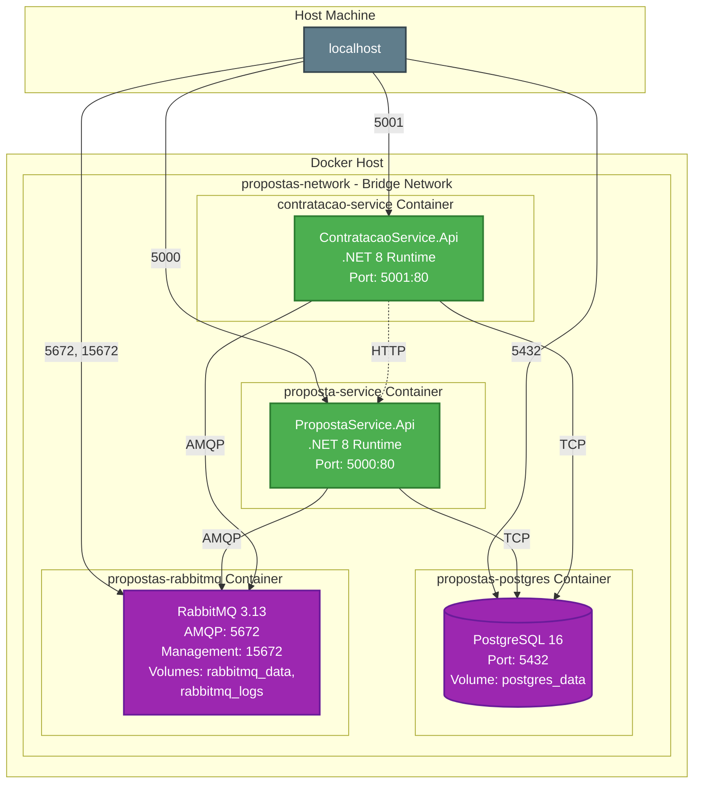

# Arquitetura do Sistema - Gestão de Propostas e Contratação

## Diagrama de Arquitetura Completo

```mermaid
graph TB
    subgraph "Clientes"
        CLIENT[Cliente/Aplicação Frontend]
    end

    subgraph "API Gateway / Load Balancer"
        LB[Load Balancer<br/>Port 5000/5001]
    end

    subgraph "PropostaService - Microserviço"
        subgraph "PropostaService.Api :5000"
            PS_API[Controllers<br/>- PropostaController<br/>- HealthController]
            PS_MW[Middlewares<br/>- Exception Handler<br/>- Logging]
        end

        subgraph "PropostaService.Application"
            PS_HANDLERS[Handlers - MediatR<br/>- CriarPropostaHandler<br/>- AtualizarPropostaHandler<br/>- AlterarStatusHandler<br/>- ObterPropostaHandler<br/>- ListarPropostasHandler]
            PS_VALIDATORS[Validators - FluentValidation<br/>- CriarPropostaValidator<br/>- AtualizarPropostaValidator<br/>- AlterarStatusValidator]
            PS_BEHAVIORS[Behaviors - Pipeline<br/>- ValidationBehavior<br/>- LoggingBehavior<br/>- TransactionBehavior]
            PS_DTOS[DTOs<br/>- PropostaDto<br/>- CriarPropostaDto<br/>- AtualizarPropostaDto]
            PS_MAPPINGS[AutoMapper<br/>- PropostaMappingProfile]
        end

        subgraph "PropostaService.Domain"
            PS_ENTITIES[Entities<br/>- Proposta<br/>- Cliente<br/>- Seguro]
            PS_VOS[Value Objects<br/>- Cpf<br/>- Dinheiro<br/>- TipoSeguro]
            PS_SERVICES[Domain Services<br/>- PropostaValidationService]
            PS_SPECS[Specifications<br/>- PropostaAprovadaSpec]
            PS_EVENTS[Domain Events<br/>- PropostaCriadaEvent<br/>- PropostaAprovadaEvent<br/>- PropostaRejeitadaEvent]
            PS_EXCEPTIONS[Exceptions<br/>- DomainException<br/>- PropostaInvalidaException]
        end

        subgraph "PropostaService.Infrastructure"
            PS_REPOS[Repositories<br/>- PropostaRepository<br/>- UnitOfWork]
            PS_CONTEXT[DbContext<br/>- PropostaDbContext]
            PS_MESSAGING[Messaging<br/>- RabbitMQ Publisher]
            PS_CONFIGS[Configurations<br/>- Entity Configs]
        end
    end

    subgraph "ContratacaoService - Microserviço"
        subgraph "ContratacaoService.Api :5001"
            CS_API[Controllers<br/>- ContratoController<br/>- HealthController]
            CS_MW[Middlewares<br/>- Exception Handler<br/>- Logging]
        end

        subgraph "ContratacaoService.Application"
            CS_HANDLERS[Handlers - MediatR<br/>- CriarContratoHandler<br/>- ObterContratoHandler<br/>- ListarContratosHandler<br/>- VerificarPropostaHandler]
            CS_VALIDATORS[Validators - FluentValidation<br/>- CriarContratoValidator]
            CS_BEHAVIORS[Behaviors - Pipeline<br/>- ValidationBehavior<br/>- LoggingBehavior<br/>- TransactionBehavior]
            CS_SAGA[Saga Orchestration<br/>- ContratacaoSaga<br/>- VerificarPropostaStep<br/>- CriarContratoStep<br/>- NotificarContratoStep]
            CS_DTOS[DTOs<br/>- ContratoDto<br/>- CriarContratoDto<br/>- PropostaDto]
            CS_MAPPINGS[AutoMapper<br/>- ContratoMappingProfile]
            CS_CLIENT[HTTP Client<br/>- PropostaServiceClient]
        end

        subgraph "ContratacaoService.Domain"
            CS_ENTITIES[Entities<br/>- Contrato<br/>- Proposta]
            CS_VOS[Value Objects<br/>- PropostaId]
            CS_SERVICES[Domain Services<br/>- ContratoValidationService<br/>- PropostaValidationService]
            CS_SPECS[Specifications<br/>- ContratoAtivoSpec<br/>- PropostaAprovadaSpec]
            CS_EVENTS[Domain Events<br/>- ContratoCriadoEvent<br/>- ContratoAprovadoEvent<br/>- ContratoRejeitadoEvent]
            CS_EXCEPTIONS[Exceptions<br/>- DomainException<br/>- ContratoInvalidoException<br/>- PropostaNaoAprovadaException]
        end

        subgraph "ContratacaoService.Infrastructure"
            CS_REPOS[Repositories<br/>- ContratoRepository<br/>- UnitOfWork]
            CS_CONTEXT[DbContext<br/>- ContratacaoDbContext]
            CS_MESSAGING[Messaging<br/>- RabbitMQ Publisher/Consumer]
            CS_CONFIGS[Configurations<br/>- Entity Configs]
        end
    end

    subgraph "Infraestrutura - Docker"
        subgraph "Database"
            POSTGRES[(PostgreSQL 16<br/>Port: 5432<br/>Database: propostas_db)]
        end

        subgraph "Message Broker"
            RABBITMQ[RabbitMQ 3.13<br/>AMQP: 5672<br/>Management: 15672]
        end

        subgraph "Volumes"
            VOL_PG[postgres_data]
            VOL_RMQ[rabbitmq_data]
            VOL_RMQ_LOGS[rabbitmq_logs]
        end
    end

    subgraph "Testing"
        PS_TESTS[PropostaService.Tests<br/>- 186 Unit Tests<br/>- Integration Tests<br/>- xUnit + Moq + FluentAssertions]
        CS_TESTS[ContratacaoService.Tests<br/>- 71 Unit Tests<br/>- Integration Tests<br/>- xUnit + Moq + FluentAssertions]
    end

    %% Conexões Cliente
    CLIENT -->|HTTP/REST| LB
    LB -->|:5000| PS_API
    LB -->|:5001| CS_API

    %% PropostaService - Fluxo Interno
    PS_API --> PS_MW
    PS_MW --> PS_HANDLERS
    PS_HANDLERS --> PS_VALIDATORS
    PS_HANDLERS --> PS_BEHAVIORS
    PS_HANDLERS --> PS_DTOS
    PS_HANDLERS --> PS_MAPPINGS
    PS_HANDLERS --> PS_ENTITIES
    PS_ENTITIES --> PS_VOS
    PS_ENTITIES --> PS_SERVICES
    PS_ENTITIES --> PS_EVENTS
    PS_HANDLERS --> PS_REPOS
    PS_REPOS --> PS_CONTEXT

    %% ContratacaoService - Fluxo Interno
    CS_API --> CS_MW
    CS_MW --> CS_HANDLERS
    CS_HANDLERS --> CS_VALIDATORS
    CS_HANDLERS --> CS_BEHAVIORS
    CS_HANDLERS --> CS_SAGA
    CS_HANDLERS --> CS_DTOS
    CS_HANDLERS --> CS_MAPPINGS
    CS_HANDLERS --> CS_CLIENT
    CS_SAGA --> CS_ENTITIES
    CS_ENTITIES --> CS_VOS
    CS_ENTITIES --> CS_SERVICES
    CS_ENTITIES --> CS_EVENTS
    CS_HANDLERS --> CS_REPOS
    CS_REPOS --> CS_CONTEXT

    %% Comunicação entre Microserviços
    CS_CLIENT -.->|HTTP GET| PS_API
    CS_SAGA -.->|Verificar Proposta| PS_API

    %% Conexões com Banco de Dados
    PS_CONTEXT -->|EF Core| POSTGRES
    CS_CONTEXT -->|EF Core| POSTGRES
    POSTGRES --> VOL_PG

    %% Conexões com Message Broker
    PS_MESSAGING -->|Publish Events| RABBITMQ
    CS_MESSAGING -->|Pub/Sub Events| RABBITMQ
    RABBITMQ --> VOL_RMQ
    RABBITMQ --> VOL_RMQ_LOGS

    %% Testes
    PS_TESTS -.->|Test| PS_HANDLERS
    PS_TESTS -.->|Test| PS_ENTITIES
    PS_TESTS -.->|Test| PS_REPOS
    CS_TESTS -.->|Test| CS_HANDLERS
    CS_TESTS -.->|Test| CS_ENTITIES
    CS_TESTS -.->|Test| CS_REPOS

    %% Estilos
    classDef apiStyle fill:#4CAF50,stroke:#2E7D32,stroke-width:3px,color:#fff
    classDef domainStyle fill:#2196F3,stroke:#1565C0,stroke-width:2px,color:#fff
    classDef infraStyle fill:#FF9800,stroke:#E65100,stroke-width:2px,color:#fff
    classDef dbStyle fill:#9C27B0,stroke:#6A1B9A,stroke-width:3px,color:#fff
    classDef testStyle fill:#607D8B,stroke:#37474F,stroke-width:2px,color:#fff

    class PS_API,CS_API apiStyle
    class PS_ENTITIES,PS_VOS,CS_ENTITIES,CS_VOS domainStyle
    class POSTGRES,RABBITMQ dbStyle
    class PS_REPOS,CS_REPOS,PS_CONTEXT,CS_CONTEXT infraStyle
    class PS_TESTS,CS_TESTS testStyle
```

## Diagrama de Camadas - Clean Architecture

## Diagrama de Fluxo - Criação de Contrato

## Diagrama de Deployment - Docker

## Tecnologias Utilizadas

### Backend
- **.NET 8** - Framework principal
- **ASP.NET Core** - Web API
- **C# 12** - Linguagem de programação

### Arquitetura e Padrões
- **Clean Architecture** - Separação de responsabilidades
- **DDD (Domain-Driven Design)** - Modelagem de domínio
- **CQRS** - Command Query Responsibility Segregation
- **MediatR** - Mediator pattern
- **Repository Pattern** - Abstração de acesso a dados
- **Unit of Work** - Gerenciamento de transações
- **Saga Pattern** - Orquestração de transações distribuídas
- **Specification Pattern** - Regras de negócio reutilizáveis

### Bibliotecas
- **Entity Framework Core 8** - ORM
- **FluentValidation** - Validação de entrada
- **AutoMapper** - Mapeamento de objetos
- **MassTransit** - Message Bus abstraction
- **Serilog** - Logging estruturado

### Testes
- **xUnit** - Framework de testes
- **Moq** - Mocking framework
- **FluentAssertions** - Asserções fluentes
- **EF Core InMemory** - Testes de integração
- **186 testes** (PropostaService)
- **71 testes** (ContratacaoService)

### Infraestrutura
- **PostgreSQL 16** - Banco de dados relacional
- **RabbitMQ 3.13** - Message broker
- **Docker & Docker Compose** - Containerização
- **Alpine Linux** - Imagens base leves

### DevOps
- **Multi-stage Dockerfile** - Build otimizado
- **Docker Compose** - Orquestração local
- **Health Checks** - Monitoramento de saúde
- **Volume Persistence** - Dados persistentes

## Características Principais

### PropostaService
? Gestão completa de propostas de seguro
? CRUD de propostas
? Validação de CPF
? Value Objects (Cpf, Dinheiro, TipoSeguro)
? Domain Events
? Publicação de eventos no RabbitMQ

### ContratacaoService
? Gestão de contratos
? Saga Pattern para orquestração
? Integração com PropostaService
? Validação de propostas aprovadas
? Ciclo de vida do contrato (Ativo, Suspenso, Cancelado, Expirado)
? Consumo e publicação de eventos

### Comunicação
? REST API entre microserviços
? Event-Driven Architecture
? Mensageria assíncrona (RabbitMQ)
? Health checks para monitoramento

## Portas e Endpoints

| Serviço | Porta | Descrição |
|---------|-------|-----------|
| PropostaService | 5000 | API REST |
| ContratacaoService | 5001 | API REST |
| PostgreSQL | 5432 | Banco de dados |
| RabbitMQ AMQP | 5672 | Message broker |
| RabbitMQ Management | 15672 | Interface web |

## Variáveis de Ambiente

Configuradas no arquivo `.env`:
- `POSTGRES_USER` - Usuário do banco
- `POSTGRES_PASSWORD` - Senha do banco
- `POSTGRES_DB` - Nome do banco
- `POSTGRES_PORT` - Porta do PostgreSQL
- `RABBITMQ_USER` - Usuário do RabbitMQ
- `RABBITMQ_PASSWORD` - Senha do RabbitMQ
- `RABBITMQ_VHOST` - Virtual host
- `RABBITMQ_PORT` - Porta AMQP
- `RABBITMQ_MANAGEMENT_PORT` - Porta do management UI
